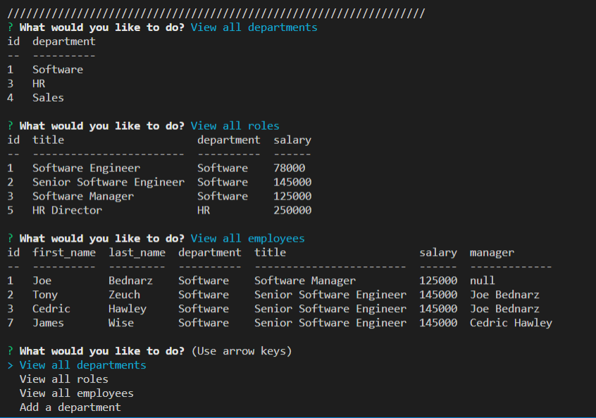

# Employee Tracker
Keep track of employees, roles, salaries, managers, and more in this Command-line interface application.

## Features
* Add departments, employees, and job roles to database.
* Display employees, job roles, and/or departments in an organized table.
* Update an employees job title.

## Potential Future Upgrades
* Allow for removal of departments, employees, or roles.
* Allow updates of managers and salaries.
* View employees by manager or department as additional options.
* View total department budget, based on sum of employees salaries.

## Example Screenshot

## Demonstration Video
https://drive.google.com/file/d/1D7KHptbBzCE23qRJbFz8RsCjzQoB0cZS/view